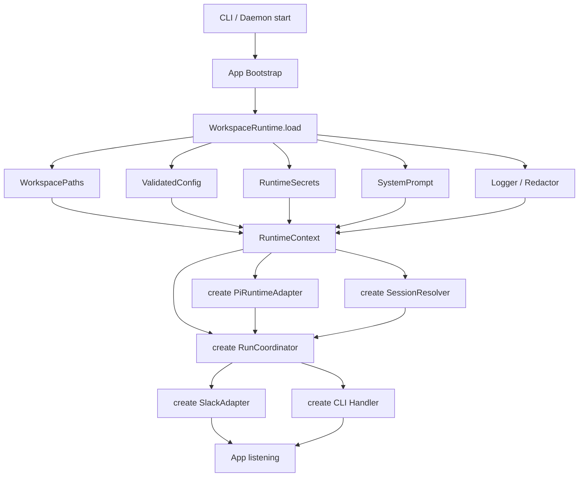
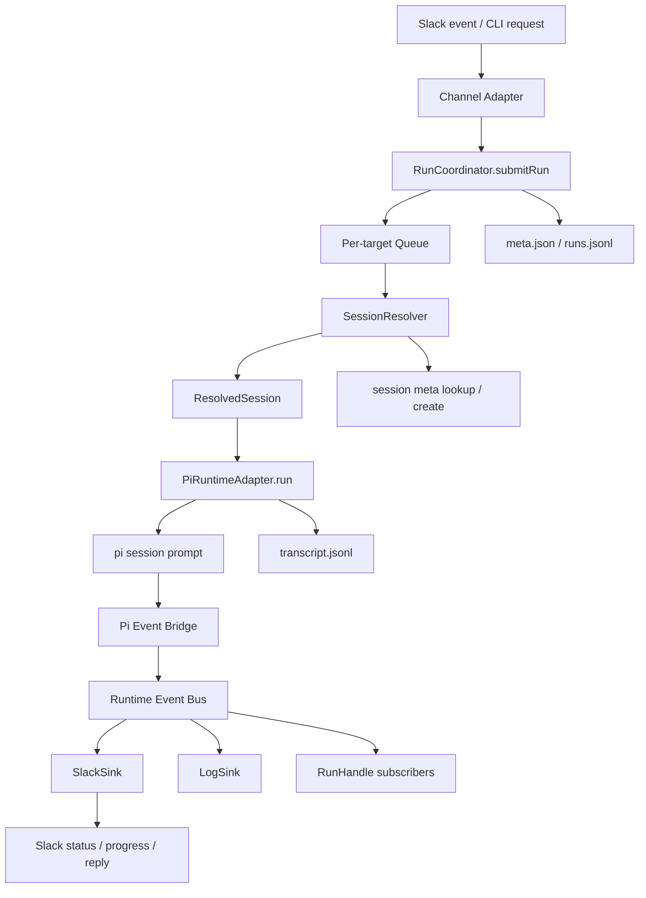

# pi-slack-agent-foundation

## 概述

本 spec 定义一个新的 Moego agent 基座项目：以 `pi-agent-core` / `pi-ai` / `pi-coding-agent` 作为底层 agent runtime，以 `.moego-agent` workspace 和 Slack 渲染能力作为产品外壳，抽取出可复用的 Slack-first agent foundation。

它不是既有 Slack agent 服务的原地重构，也不是某个业务专属 agent 的产品化 fork，而是一个面向 Moego 内部复用的新基座：

1. 底层使用 pi runtime 实战路径：`createAgentSession`、`SessionManager.open`、`DefaultResourceLoader`、`SettingsManager`、pi coding tools、pi native extension / hooks、`session.subscribe` 事件聚合。
2. 产品外壳提供 files-first workspace、配置 / env 边界、Slack 三载体渲染、结构化日志、CLI / daemon 装配、run queue、live E2E。
3. 默认 Slack-first，但底层 runtime 不认识 Slack；Slack 只消费标准化后的 `AgentRuntimeEvent`。
4. 坚持 files-first：不引入 SQLite / ORM；pi transcript 是模型上下文恢复的唯一权威。

## 目标

1. 提供一个可复用的 agent runtime foundation，支持在任意 workspace 下启动一个 Slack-connected pi agent。
2. 使用 pi 原生 session / transcript / extension 体系，避免重新实现 agent loop、tools、compact、extension loader。
3. 提供 `.moego-agent` workspace 契约，承载配置、system prompt、sessions、logs，并预留 audit / artifacts 扩展位。
4. 提供稳定的 `AgentRuntimeEvent`，让 Slack renderer、CLI renderer、logs/replay 能消费统一事件，而不直接依赖 pi event 类型。
5. 提供 Slack Assistant 风格渲染能力：ack reaction、status、progress、final reply、usage tail、terminal reaction。
6. 引入结构化 log + redactor 体系，作为基座默认 observability。

## 非目标

MVP 不做以下能力：

1. 不兼容迁移旧 Slack agent 历史 session。
2. 不把业务专属 prompt、CS 工单能力、SQLite 查询层搬进基座。
3. 不提供自定义 `MoegoExtension` hook 层；extension 单层暴露 pi 原生能力。
4. 不实现 memory recall；Context Runtime 预留 memory 位置，但 MVP 不实现。
5. 不实现 Telegram / Wechat / scheduled tasks / dashboard。
6. 不默认持久化完整 runtime event stream；`events.jsonl` 仅作为未来 debug/replay 模式。
7. 不做 warm session cache；MVP 每轮 run open/resume session，结束后释放。

## 系统架构

### 启动装载



### 运行时请求流



核心分层：

1. **Product App Layer**：Slack adapter、CLI、daemon，只负责入口、认证、生命周期。
2. **App Bootstrap**：启动期装配层。调用 `WorkspaceRuntime.load()`，得到 `RuntimeContext`，再创建 RunCoordinator、PiRuntimeAdapter、Slack adapter 等依赖。
3. **Workspace Runtime / RuntimeContext Provider**：解析 `.moego-agent`、加载并校验 `config.yaml`、读取 env/secrets、加载 `system.md`、生成 `WorkspacePaths`、创建 logger/redactor。该层不调用 pi API。
4. **RunCoordinator**：单轮 run 的 channel-agnostic 控制面。负责 per-target queue、在 queue 内调用 `SessionResolver.resolve(target)`、创建 abort signal、调用 `PiRuntimeAdapter.run(...)`、multicast runtime events、写 run/meta 状态。它的价值是避免 Slack adapter / CLI 各自实现一套 run 生命周期控制，同时保持 PiRuntimeAdapter 只做 pi 执行。
5. **Pi Runtime Adapter**：唯一直接调用 pi API 的层。只消费 `RuntimeContext + ResolvedSession + AgentRunInput`，负责 open/resume session、配置 pi resource/model/auth、加载 pi extension、prompt、释放。不得自己读取 `config.yaml`、`.env.local`、`system.md` 或拼 `.moego-agent` 路径。
6. **Pi Event Bridge**：将 `session.subscribe` 的 pi events 规整成 `AgentRuntimeEvent`。
7. **Render Layer**：SlackEventSink + SlackRenderer，消费 `AgentRuntimeEvent`，产出 Slack UI。
8. **Persistence / Observability**：pi transcript + product meta/runs/logs。

启动期装配链路：

```text
CLI / Daemon
  → AppBootstrap.start()
    → WorkspaceRuntime.load(workspaceDir)
      → WorkspacePaths
      → ValidatedConfig
      → RuntimeSecrets
      → SystemPrompt
      → Logger / Redactor
    → create PiRuntimeAdapter(RuntimeContext)
    → create RunCoordinator(RuntimeContext, PiRuntimeAdapter, SessionResolver)
    → create SlackAdapter(RunCoordinator)
```

职责边界：

| 能力 | 归属 | 说明 |
|---|---|---|
| `.moego-agent/config.yaml` 读取 / zod 校验 | Workspace Runtime | 行为配置唯一权威，产出 `ValidatedConfig` |
| `.env.local` / process env 读取 | Workspace Runtime / SecretLoader | 只读凭证、baseUrl、log level，不读行为配置 |
| `.moego-agent/system.md` 读取 | Workspace Runtime / SystemPromptLoader | 产出最终 system prompt 输入 |
| workspace root / `.moego-agent` 路径 | Workspace Runtime | 产出 `WorkspacePaths`，禁止下游手拼路径 |
| logger / redactor 初始化 | Workspace Runtime | redactor 基于 env secrets 初始化 |
| skills / extensions 目录解析 | Workspace Runtime | 只解析路径和配置，不执行 extension |
| per-target queue / abort / event fanout | RunCoordinator | 单轮 run 控制面，跨 Slack / CLI 复用 |
| SessionTarget → ResolvedSession | SessionResolver | 必须在 RunCoordinator 的 per-target queue 内、调用 PiRuntimeAdapter 之前完成 |
| pi session open/resume/prompt | Pi Runtime Adapter | 消费 `RuntimeContext`，驱动 pi 执行 |
| pi resource/model/auth/settings 装配 | Pi Runtime Adapter | 使用上游传入的 config/secrets/system/path，不直接读文件/env |

调用链：

```text
SlackAdapter.onMessage(event)
  → RunCoordinator.submitRun(input)
    → queue.enqueue(target, async () => {
        const session = await SessionResolver.resolve(target)
        const iter = PiRuntimeAdapter.run({ ...input, session }, signal)
        fanout(iter, [SlackSink, LogSink, RunHandleEventBus])
      })
  → RunHandle { abort(), events }
```

## 底层能力设计

### Runtime Session 模式

MVP 使用 **run-scoped session**：

```text
每次对话开始:
  resolve session target → sessionDir / transcriptPath
  open/resume pi transcript
  subscribe pi events
  session.prompt(input, { signal })
  write run summary
  释放 pi session 内存引用

下次对话:
  根据同一个 session target 找到 transcript
  open/resume 后继续 prompt
```

不做 warm session cache，因此不需要 idle sweep。

仍需要 per-session queue / lock（内存级，单进程），原因不是缓存 session，而是防止同一个 Slack thread 并发两轮同时创建 session 或写同一个 transcript。

| 能力 | MVP 是否需要 | 说明 |
|---|---|---|
| run-scoped open/resume/释放 | Y | 生命周期简单，重启语义一致 |
| per-session queue / lock | Y | 保证同一 session 串行写 transcript |
| idle sweep | N | warm session cache 才需要 |
| inflight session create 去重 | N / 弱化 | queue 已保证同 session 不并发 run；跨 session 不需要去重 |
| abort current run | Y | Slack stop / supersede 需要 |
| warm session cache | Future | 如冷启动成本不可接受再引入 |

### Session Resolver

负责 SessionTarget → session 目录 / transcript 路径的映射。

```ts
export interface SessionResolver {
  resolve(target: SessionTarget): Promise<ResolvedSession>
}

export interface ResolvedSession {
  sessionId: string
  sessionDir: string        // .moego-agent/sessions/<session-id>/
  transcriptPath: string    // .moego-agent/sessions/<session-id>/transcript.jsonl
  isNew: boolean
}
```

解析逻辑：

1. **查找**：遍历 `sessions/*/meta.json`，匹配 `surface + conversationId + threadId`。命中则返回已有 session。
2. **创建**：未命中时生成 sessionId，创建 sessionDir，写入 `meta.json`（status: idle）。
3. **可选加速索引**：`sessions/index.jsonl` 作为查找缓存，append-only。启动时可从 meta.json 重建。MVP 可以不实现 index.jsonl，直接 readdir + 读 meta.json（session 数量 < 1000 时性能足够）。

原子性保证：
- 创建 session 时先 `mkdirSync` 再写 meta.json；如果 meta.json 写入失败，目录存在但无 meta 视为无效 session，下次 resolve 忽略。
- `SessionResolver.resolve(target)` 必须在 per-target queue 内执行；queue 保证同一 target 不会并发 resolve，因此不需要文件锁。

### Pi Runtime Adapter

Pi Runtime Adapter 是 **agent 执行适配层**，不是 config/env/system loader。它的依赖必须在启动期由 Workspace Runtime 统一装配后注入：

```ts
export interface RuntimeContext {
  workspace: {
    rootDir: string
    paths: WorkspacePaths
  }
  config: ValidatedConfig
  secrets: RuntimeSecrets
  systemPrompt: string
  logger: Logger
  redactor: Redactor
}

export interface PiRuntimeAdapterDeps {
  context: RuntimeContext
}
```

边界规则：

- 可以用 `context.workspace.paths.sessionsDir` / `input.session.transcriptPath` open pi session。
- 可以用 `context.config.agent.model`、`context.secrets`、`context.systemPrompt` 装配 pi model / auth / prompt。
- 可以用 `context.workspace.paths.skillsDir` / `extensionsDir` 配置 pi resource loader。
- 不可以自己读 `config.yaml`、`.env.local`、`system.md`。
- 不可以自己拼 `.moego-agent` 路径或创建全局 logger/redactor。

对外接口：

```ts
export interface AgentRuntime {
  run(input: AgentRunInput, signal?: AbortSignal): AsyncIterable<AgentRuntimeEvent>
}
```

生命周期契约：

- `run()` 接受 `AbortSignal`。
- 正常完成：iterator yield `run.completed` 然后 return。
- abort 被触发：iterator yield `run.stopped` 然后 return（不 throw）。
- pi 内部错误：iterator yield `run.failed` 然后 return（不 throw）。
- 调用方通过 `signal.abort()` 触发停止；内部将 signal 传递给 pi `session.prompt`（如 pi 支持）或在下一个 event 检查点中断。

abort 粒度：
- 如果 pi `session.prompt` 支持 AbortSignal → token 级中断。
- 如果不支持 → turn 级中断（等当前 tool call 完成后检查 signal）。
- 需要 spike 验证 pi 的 abort 支持粒度。

不再暴露独立的 `abort()` / `dispose()` 方法。abort 通过 signal 传递；session 内存释放是 `run()` 内部的 finally 逻辑。

```ts
export interface AgentRunInput {
  runId: string
  target: SessionTarget
  session: ResolvedSession
  prompt: string
  actor?: RuntimeActor
}

export interface RuntimeActor {
  id: string              // Slack user ID 或 CLI user
  name?: string
  surface: 'slack' | 'cli' | 'api'
}

export interface SessionTarget {
  surface: 'slack' | 'cli' | 'api'
  workspaceId: string
  conversationId: string
  threadId?: string
}
```

内部使用 pi 原语：

- `SessionManager.open(transcriptPath, sessionsDir)`
- `createAgentSession(...)`
- `DefaultResourceLoader`
- `SettingsManager`
- `ModelRegistry`
- `AuthStorage`
- `session.prompt(input, { signal? })`
- `session.subscribe(...)`
- `session.agent.beforeToolCall / afterToolCall`

### AgentRuntimeEvent

对外封装 `AgentRuntimeEvent`，不暴露 pi 原始 event。

```ts
export type AgentRuntimeEvent =
  | { type: 'run.started'; runId: string; at: string }
  | { type: 'activity.changed'; activity: ActivitySnapshot }
  | { type: 'tool.started'; tool: ToolCallView }
  | { type: 'tool.finished'; tool: ToolCallView }
  | { type: 'message.committed'; text: string; messageId?: string }
  | { type: 'usage.updated'; usage: UsageSnapshot }
  | { type: 'context.compacted'; beforeTokens: number; afterTokens: number }
  | { type: 'run.completed'; final: FinalRunState }
  | { type: 'run.failed'; error: RuntimeErrorView }
  | { type: 'run.stopped'; reason: AbortReason }

export interface ActivitySnapshot {
  phase: 'thinking' | 'tool' | 'writing'
  label: string           // 人类可读，如 "Running bash: ls -la"
  toolName?: string
  startedAt: string
}

export interface UsageSnapshot {
  inputTokens: number
  outputTokens: number
  cacheReadTokens?: number
  cacheWriteTokens?: number
  totalCost?: number
}

export interface FinalRunState {
  usage: UsageSnapshot
  toolCounts: Record<string, number>
  messageCount: number
  durationMs: number
}

export interface RuntimeErrorView {
  message: string
  name?: string
  retryable: boolean
  providerError?: boolean
}

export type AbortReason = 'user_stop' | 'superseded' | 'timeout' | 'system'

export interface ToolCallView {
  toolName: string
  callId: string
  params?: Record<string, unknown>   // 脱敏后的参数摘要
  output?: string                    // 脱敏后的输出摘要（tool.finished 时填充）
  durationMs?: number                // tool.finished 时填充
}
```

封装理由：

1. Slack / CLI / logs 不直接依赖 pi event 类型。
2. pi event 变化只影响 `PiEventBridge`。
3. 可以把 pi 的细粒度事件聚合成产品需要的稳定语义。
4. 可以保留 `AgentRuntimeEvent` 作为 renderer contract 和单测 mock contract。

不默认持久化完整 `AgentRuntimeEvent` stream；MVP 只把 run 摘要写入 `runs.jsonl`。未来可加 debug 模式记录 `events.jsonl`。

### Pi Event Bridge 映射

PiEventBridge 负责将 pi `session.subscribe` 事件转换为 `AgentRuntimeEvent`。

已知 pi 事件来源（需 spike 确认完整列表）：

| pi 事件来源 | 产出的 AgentRuntimeEvent |
|---|---|
| `session.subscribe` - message start | `activity.changed { phase: 'thinking' }` |
| `session.subscribe` - message content | `activity.changed { phase: 'writing' }` |
| `session.subscribe` - message complete | `message.committed` |
| `session.subscribe` - usage | `usage.updated` |
| `session.agent.beforeToolCall` hook | `tool.started` + `activity.changed { phase: 'tool' }` |
| `session.agent.afterToolCall` hook | `tool.finished` |
| `session.subscribe` - session end | `run.completed` |
| `session.subscribe` - error | `run.failed` |
| `session.subscribe` - compact event（如有） | `context.compacted` |

备选方案：如果 pi `session.subscribe` 不 emit tool-level 事件，通过 `beforeToolCall/afterToolCall` hook 自行 emit `tool.started/finished`。

### Compact 策略

MVP 将 compact 委托给 pi runtime，但需要可观测和兜底：

**假设（需 spike 验证）：**
- pi-agent-core 内置 auto-compact，触发条件为 input_tokens 接近 context window 上限。
- compact 后 transcript.jsonl 追加 compact entry（摘要替代早期 turns 原文）。
- compact 事件通过 `session.subscribe` 或 hook 可观测。

**MVP 要求：**

1. **可观测**：compact 发生时产出 `context.compacted` 事件，记录到 `runs.jsonl` 和 logs。
2. **可配置**：`config.yaml` 预留 compact 配置位，MVP 使用 pi 默认值。
3. **兜底**：如果 pi 不内置 compact 或行为不可控，基座需要自行实现 compact trigger（调用 pi 的 summarization 能力压缩早期 turns）。这是 P0 spike 项。

```yaml
runtime:
  compact:
    enabled: true          # 是否启用 auto-compact（委托 pi）
    # threshold: 0.8       # 触发阈值（input_tokens / context_window），待 spike 后确认
    # strategy: summarize  # 待 spike 后确认
```

**验证标准：** 长对话（>20 轮）resume 后模型仍能引用早期对话内容，证明 compact 没有丢失关键上下文。

### Extension 模型

extension 单层：只暴露 pi 原生 extension / hook 能力。

基座不定义 `MoegoExtension`，只负责：

1. 从 `.moego-agent/extensions` 和配置声明加载 pi native extensions。
2. 为 extension 提供 workspace cwd、logger、redactor、env/secrets 读取约束。
3. 文档明确 extension 与 pi 版本绑定，基座不承诺跨 runtime 通用。
4. 基座自身能力也尽量写成 pi extension 或 pi tool/hook。

理由：

1. 可以直接复用 pi 社区 extension。
2. 自己实现的 extension 也能在其他 pi 场景复用。
3. 少一层 adapter，降低基座复杂度。
4. 避免自定义 hook 覆盖不完整导致能力滞后。

MVP 不启用任何 extension（配置 `extensions.enabled: []`），但 extension 加载路径需要存在：读取配置 → 空列表 → 跳过加载。

### Tool Runtime

MVP 直接使用 pi-coding-agent tools，并做最小 policy 包装：

| Tool | 来源 | MVP |
|---|---|---|
| read | pi-coding-agent | Y |
| bash | pi-coding-agent | Y |
| edit | pi-coding-agent | Y |
| write | pi-coding-agent | Y |
| grep | pi-coding-agent | Y |
| find | pi-coding-agent | Y |
| ls | pi-coding-agent | Y |
| ask_confirm | 自研 pi tool | Future |
| MCP tools | pi extension / 自研 runtime | Future |

基础 policy：

1. write/edit path guard：写操作不能逃出 workspace root（即 `.moego-agent` 的父目录，与 pi session cwd 相同）。
2. bash output cap：避免超大输出撑爆上下文。
3. bash spawn hook：处理 path-like env 的 `~/` 展开。
4. beforeToolCall log：记录 tool name 与脱敏参数摘要。
5. afterToolCall redaction：工具输出进入 transcript 前脱敏。

### Context Runtime

MVP 做：

1. system prompt composition：`system.md` + runtime prefix。
2. workspace docs loading：可选加载 `AGENTS.md` / `.moego-agent/system.md`。
3. pi skills/resource loader：走 pi 原生能力。

MVP 不做：

- Slack thread bootstrap（延后到 Slack E2E 稳定后）。
- attachments/images（延后）。
- memory recall（仅保留设计位）。

```text
Context Runtime
  system prompt
  workspace docs
  skills（pi 内置）
  current actor/thread
  memory recall       # Future
  compact             # 委托 pi，见 Compact 策略章节
```

## Workspace 结构

> MVP 单进程单副本部署。per-session queue/lock 为内存级。如未来需要多副本，lock 需升级为文件锁或外部协调。

工作区目录固定为 `<workspace>/.moego-agent/`。

```text
<workspace>/.moego-agent/
  config.yaml
  system.md
  sessions/
    <session-id>/
      transcript.jsonl
      meta.json
      runs.jsonl
  skills/
  extensions/
  logs/
    agent-YYYY-MM-DD.log
```

| 路径 | 作用 |
|---|---|
| `config.yaml` | 行为配置唯一权威 |
| `system.md` | workspace system prompt |
| `sessions/<session-id>/transcript.jsonl` | pi 原生 transcript，模型上下文恢复权威 |
| `sessions/<session-id>/meta.json` | 产品侧元信息：Slack 映射、status、createdAt、updatedAt |
| `sessions/<session-id>/runs.jsonl` | 每轮 run 摘要：usage、toolCounts、terminal、message ts、error digest |
| `skills/` | workspace-local skills，走 pi resource loader |
| `extensions/` | workspace-local pi native extensions；MVP 不启用任何 extension，但加载路径需存在（读取配置 → 空列表 → 跳过加载） |
| `logs/` | 结构化运行日志 |

MVP 不创建的目录（延后）：
- `audit/`：MVP 不实现审计。
- `sessions/<id>/artifacts/`：无附件需求。
- `sessions/index.jsonl`：session 数量 < 1000 时直接 readdir + meta.json lookup。

## 持久化设计

### 核心决策

1. **pi transcript 是 session 权威**：不再复制一份 normalized messages。
2. **run summary 是产品观测权威**：`runs.jsonl` 记录每轮结果，不记录完整 event stream。
3. **logs 是排障权威**：结构化日志保存错误栈、provider 响应摘要、redacted tool 参数。
4. **events.jsonl 不进 MVP**：未来作为 debug/replay 开关。

### Transcript 容错

如果进程在写 `transcript.jsonl` 时 crash（半行 JSON），pi `SessionManager.open` 可能 parse error。

恢复策略：
1. open 时 try-catch；如果 parse error，执行 `validateTranscript`。
2. `validateTranscript`：逐行读取，truncate 到最后一个完整 JSON line。
3. truncate 后重试 open；如果仍然失败，标记 session 为 `corrupted`，创建新 session。
4. 需要 spike 验证 pi 对 truncated transcript 的内置容错行为；如果 pi 已内置，基座不重复实现。

### 数据模型

```ts
export interface SessionMeta {
  schemaVersion: 1
  sessionId: string
  workspaceId: string
  transcriptPath: string
  surface: 'slack' | 'cli' | 'api'
  conversationId: string
  threadId?: string
  slack?: {
    teamId?: string
    channelId: string
    channelName?: string
    threadTs: string
    sourceMessageTs?: string
  }
  status: 'idle' | 'running' | 'stopped' | 'failed' | 'corrupted'
  createdAt: string
  updatedAt: string
}

export interface RunRecord {
  schemaVersion: 1
  runId: string
  sessionId: string
  startedAt: string
  endedAt?: string
  status: 'running' | 'completed' | 'stopped' | 'failed'
  model?: { provider: string; id: string }
  usage?: UsageSnapshot
  toolCounts?: Record<string, number>
  compacted?: boolean
  output?: {
    committedMessageCount: number
    slackMessageTs?: string[]
  }
  error?: {
    message: string
    name?: string
    stackDigest?: string
  }
}
```

### 为什么不拆 `messages.jsonl`

只有当产品 UI 展示状态与模型上下文属于两套独立数据时，才需要额外维护 normalized messages。新基座 MVP 的 UI 是 Slack thread，本身已经是展示历史；模型上下文由 pi transcript 负责。因此不需要再维护一份 product-normalized messages。

如未来需要 dashboard 或 replay，可基于 pi transcript + runs/logs 投影，或再引入 debug `events.jsonl`。

## 配置

`config.yaml` 是行为配置唯一权威；env 只放凭证、部署差异和调试项。

```yaml
agent:
  name: default
  model: litellm/claude-sonnet-4-6
  thinkingLevel: medium
  maxTurns: 50

runtime:
  provider: pi
  transcript:
    mode: workspace
  compact:
    enabled: true
  debug:
    persistEvents: false

extensions:
  enabled: []

slack:
  enabled: true
  assistant:
    enabled: true          # 硬依赖 Slack Assistant API；false 时 start 报错退出
    suggestedPrompts: true
```

env 示例：

```bash
SLACK_BOT_TOKEN=xoxb-...
SLACK_APP_TOKEN=xapp-...
SLACK_SIGNING_SECRET=...
LITELLM_API_KEY=...
LITELLM_BASE_URL=...
LOG_LEVEL=info
```

禁止把 `AGENT_MODEL` / `AGENT_PROVIDER` 这类行为配置放回 env。

config 校验：启动时用 zod schema 校验 `config.yaml`；缺少必填字段或类型错误时 start 报明确错误信息并退出，不 crash。

## Slack 渲染设计

MVP 硬依赖 Slack Assistant API。如果目标 workspace 不支持 Assistant feature，`start` 时检测并 fail-fast 报错退出。

Slack 继续采用三载体模型：

1. **Reaction**：原消息 ack / done / error / stopped。
2. **Assistant status**：`assistant.threads.setStatus` 显示当前思考 / 工具 / retry。
3. **Thread replies**：最终回复、usage tail、必要的 terminal message。

`SlackRenderer` 保持纯 I/O 门面；`SlackEventSink` 持有 turn-local 状态：

```ts
interface SlackTurnState {
  progressMessageTs?: string
  toolHistory: Map<string, number>
  latestActivity?: ActivitySnapshot
  pendingUsage?: UsageSnapshot
  terminal?: 'completed' | 'stopped' | 'failed'
}
```

事件映射：

| AgentRuntimeEvent | Slack 行为 |
|---|---|
| `run.started` | add ack reaction、set initial status |
| `activity.changed` | setStatus / upsert progress |
| `tool.started` | 累加 toolHistory、更新 progress |
| `message.committed` | post thread reply |
| `usage.updated` | 暂存 usage |
| `context.compacted` | log 记录，可选 status 提示"正在压缩上下文" |
| `run.completed` | clear status、finalize progress、post usage tail、done reaction |
| `run.failed` | clear status、error progress、error reaction、post error message |
| `run.stopped` | clear status、stopped progress、stopped reaction |

Slack render 失败处理：
- `invalid_blocks` → 纯文本重发。
- 其他 Slack API error → warn log，不冒泡到 runtime。
- terminal reply（`run.completed` 的最终消息）发送失败 → 写 run error digest 到 `runs.jsonl`。

## Logging / Observability

日志系统采用结构化、可脱敏、可落盘的默认设计：

1. `logger.withTag('<tag>')`
2. redactor 基于 env secrets
3. log file: `.moego-agent/logs/agent-YYYY-MM-DD.log`
4. 错误日志必须包含结构化字段：`errorName`、`errorMessage`、`errorStack`、`errorCause`、`providerResponseBody?`
5. Slack API render 失败不冒泡到 runtime，记录 warn；runtime 失败必须进入 terminal failed。

## 安全策略

1. **Files-only**：MVP 不引入 SQLite / Drizzle / ORM。
2. **Secrets**：凭证只从 env 读取；写日志前经过 redactor。
3. **Tool path guard**：write/edit 默认限制在 workspace root（`.moego-agent` 的父目录）。尝试写 workspace 外路径时拒绝并记录违规日志。
4. **Output cap**：bash 输出默认截断，完整输出可落 artifacts（Future）。
5. **Extension trust**：pi native extension 是代码执行能力，默认只加载显式启用列表。
6. **No global singleton**：所有依赖经 `createApplication()` 注入。

## 接口设计

### CLI

MVP 只需要 `start`：

```bash
moego-agent start
```

延后（E2E 跑通后补）：

```bash
moego-agent onboard     # Future: 生成 config/system.md 模板
moego-agent doctor      # Future: 检查 env/config/Slack 连通性
moego-agent status      # Future: 显示当前 daemon 状态
moego-agent session list|show  # Future: session 管理
```

### Application

```ts
export interface Application {
  start(): Promise<void>
  stop(): Promise<void>
}

export interface CreateApplicationArgs {
  workspaceDir: string
  config: ValidatedConfig   // zod 校验后的配置
  logger: Logger
}
```

### RunCoordinator

```ts
export interface RunCoordinator {
  submitRun(input: AgentRunInput): RunHandle
  shutdown(): Promise<void>
}

export interface RunHandle {
  runId: string
  events: AsyncIterable<AgentRuntimeEvent>
  abort(reason: AbortReason): void
}
```

`RunHandle.events` 不是直接暴露 `AgentRuntime.run()` 的原始 iterator。RunCoordinator 必须把 runtime iterator multicast 到内部 event bus，再分别分发给 SlackSink、LogSink 和 RunHandle subscribers，避免普通 async iterator 被多方消费导致事件丢失。

### Runtime

```ts
export interface AgentRuntime {
  run(input: AgentRunInput, signal?: AbortSignal): AsyncIterable<AgentRuntimeEvent>
}
```

## 改动范围

这是新项目 spec，不要求直接修改既有 Slack agent 主线实现。若以当前仓库作为孵化位置，建议新增模块而不是改写旧模块：

- `src/runtime/pi/*`：pi runtime adapter、event bridge、session resolver、tool policy。
- `src/workspace/*`：`.moego-agent` paths/config/env/system loader。
- `src/slack/*`：实现 Slack renderer/sink/adapter 的新基座版本。
- `src/logger/*`：提取 logger/redactor。
- `src/runCoordinator/*`：session queue、run handle、event fanout。
- `src/cli/*`：start 命令。
- `examples/`：`.env.example`、`config.example.yaml`、`system.md`。
- `tests/`：runtime adapter、event bridge、session resolver、Slack renderer targeted tests。

## 假设

- ⚠ pi `SessionManager.open()` 支持传入 workspace-local transcript 路径，并能稳定 resume。
- ⚠ pi native extension 加载可以在不使用 pi TUI 的情况下通过 `DefaultResourceLoader` 完成。
- ⚠ Slack Assistant feature 在目标工作区可用；不可用时 `start` fail-fast 退出。
- ⚠ run-scoped session 的冷启动成本可接受；如果不可接受，后续再引入 warm cache + idle sweep。
- ⚠ pi `session.subscribe` emit 的事件粒度足以支撑 `AgentRuntimeEvent` 映射（至少包含 message start/content/complete、usage、session end、error）。tool-level 事件如果不通过 subscribe 暴露，可通过 `beforeToolCall/afterToolCall` hook 补充。
- ⚠ pi-agent-core 内置 auto-compact，触发条件为 input_tokens 接近 context window 上限；compact 后 transcript.jsonl 追加 compact entry；compact 事件可通过 subscribe 或 hook 观测。**需 spike 验证。**
- ⚠ pi `session.prompt` 支持 AbortSignal 或等效中断机制。如不支持，abort 粒度为 turn 级（等当前 tool call 完成后检查 signal）。**需 spike 验证。**
- ⚠ pi 对 truncated transcript（crash 导致半行 JSON）有内置容错或可通过 truncate-to-last-valid-line 恢复。**需 spike 验证。**
- ⚠ MVP 单进程单副本部署。

## Spike 清单

在进入实现前需要验证的 pi runtime 行为：

| # | Spike 项 | 验证方式 | 影响范围 |
|---|---|---|---|
| 1 | `session.subscribe` 事件类型完整列表 | 写 minimal script，subscribe 后跑一轮带 tool 的 prompt，dump 所有事件 | PiEventBridge 设计 |
| 2 | pi auto-compact 是否存在、触发条件、transcript 变化 | 构造长 transcript 触发 compact，观察 transcript.jsonl 变化和 subscribe 事件 | Compact 策略 |
| 3 | `session.prompt` abort 支持 | 传入 AbortSignal，中途 abort，观察行为 | abort 粒度 |
| 4 | truncated transcript 容错 | 手动截断 transcript.jsonl 最后一行，尝试 open/resume | Transcript 容错策略 |
| 5 | `DefaultResourceLoader` 加载 extension 不依赖 TUI | 在 headless 环境加载一个 pi native extension | Extension 加载 |

## 风险

1. **pi transcript 与产品 meta 不一致**
   兜底：`meta.json` 只存映射和状态，不复制模型消息；恢复以上一次成功写入 transcript 为准。

2. **不存完整 events 导致 UI 回放能力不足**
   兜底：MVP 先用 `runs.jsonl + logs` 排障；未来加 `runtime.debug.persistEvents`。

3. **pi extension 直接暴露导致版本绑定**
   兜底：锁定 pi 版本范围；upgrade 时单独跑 extension compatibility check。

4. **Slack render 失败影响用户感知**
   兜底：renderer safeRender warn，不影响 runtime；terminal reply 失败写 run error digest。

5. **run-scoped session 频繁 open/释放 性能不足**
   兜底：保留 `AgentRuntime` 抽象；后续引入 warm cache 时只替换内部生命周期。

6. **pi 不内置 compact 或 compact 策略不适合 Slack 长对话**
   兜底：spike 验证后决定是否自行实现 compact trigger。如需自行实现，scope 会显著增大，需重新评估 MVP 边界。

7. **transcript 损坏导致 session 不可恢复**
   兜底：validateTranscript + truncate-to-last-valid-line；极端情况标记 corrupted 并创建新 session。

## 验收链路

MVP 必须证明：

1. `moego-agent start` 能启动 Slack adapter 并接收 @mention。
2. Slack @mention 能触发 pi runtime，生成一条最终 thread reply。
3. 一次带工具调用的 prompt 能显示 Slack status/progress，并在完成后显示 usage tail。
4. 同一 Slack thread 第二次 @mention 能 resume 同一个 `transcript.jsonl`。
5. 同一 thread 连续两条消息不会并发写同一个 transcript（queue 串行）。
6. `.moego-agent/sessions/<session-id>/meta.json`、`runs.jsonl`、`transcript.jsonl` 均按预期落盘。
7. `.moego-agent/logs/agent-YYYY-MM-DD.log` 有结构化日志且 secrets 被脱敏。
8. Slack 发 stop 后，当前 run 在合理时间内终止，thread 收到 stopped 消息。
9. 两个不同 thread 同时 @mention，各自独立完成，不互相阻塞。
10. pi crash / provider error 时 Slack 收到 error reaction + error message，session 状态标记 failed。
11. 第二轮 prompt 时模型能引用第一轮对话内容（证明 transcript resume 上下文恢复正确）。
12. config.yaml 缺少必填字段时 start 报明确错误，不 crash。
13. 尝试 write 到 workspace 外的路径被拒绝，日志记录违规。
14. bash 输出超限时 transcript 中只保留截断内容 + 截断标记。
15. 长对话（>20 轮）resume 后模型仍能引用早期内容（compact 验证）。

建议命令：

```bash
pnpm test
pnpm lint
pnpm e2e:live basic-reply
pnpm e2e:live tool-progress
pnpm e2e:live resume-thread
pnpm e2e:live abort-stop
```

## E2E 测试策略

E2E 只保留 live 模式：真实 pi runtime + 真实 Slack test channel，验证端到端行为。

### 运行模式

- 真实调用 pi（需要 LLM API key）。
- 真实发送 Slack 消息到 test channel（需要 bot token + test channel）。
- 本地开发 smoke + 发版前必跑。CI 需配齐 secrets 才能跑，否则 skip。

### 环境要求

```bash
# E2E 专用，不复用 production token
E2E_SLACK_BOT_TOKEN=xoxb-...
E2E_SLACK_APP_TOKEN=xapp-...
E2E_SLACK_CHANNEL=C0123456789      # 专用 test channel
E2E_LITELLM_API_KEY=...
E2E_LITELLM_BASE_URL=...
E2E_WORKSPACE_DIR=/tmp/moego-agent-e2e
```

### Case 结构

每个 E2E case 的执行流程：

```text
1. setup: 启动 agent（指向 test workspace + test channel）
2. trigger: 向 test channel 发送 @mention 消息
3. wait: 轮询 Slack API 等待 terminal 信号（done/error/stopped reaction），timeout 60s
4. assert:
   - Slack thread reply 内容符合预期（正则 / 包含关键词）
   - reaction 正确（done / error / stopped）
   - 本地文件落盘正确（meta.json / runs.jsonl / transcript.jsonl / logs）
5. teardown: 清理 test workspace、停止 agent
```

### Case 列表

| Case | 触发 | 验证点 |
|---|---|---|
| `basic-reply` | 简单问题 @mention | thread reply 非空、done reaction、meta.json + runs.jsonl 落盘 |
| `tool-progress` | 需要工具调用的 prompt | status 更新过、progress 显示 tool name、usage tail |
| `resume-thread` | 同一 thread 第二次 @mention | 模型回复引用第一轮内容、transcript 为同一文件 |
| `abort-stop` | 发送 @mention 后立即发 stop | stopped reaction、run.stopped 写入 runs.jsonl |

### 超时与重试

- 单 case timeout：60s（pi cold start + LLM 响应）。
- Slack API 轮询间隔：2s。
- 不做自动重试；失败即报错，人工排查。

## 后续实现顺序

1. **Spike：验证 pi runtime 行为**
   内容：跑 Spike 清单中的 5 项验证。
   观察点：每项 spike 产出结论文档，确认或否定假设。
   验证方式：spike 脚本可重复运行。
   **阻塞后续所有步骤。**

2. **搭出端到端最小骨架**
   内容：新模块初始化、workspace paths、config loader（zod 校验）、logger、Slack @mention 到固定文本回复。
   观察点：Slack thread 能收到固定回复。
   验证方式：unit test + 手动 Slack smoke。

3. **接入 run-scoped pi runtime + session resolver**
   内容：`SessionResolver`（resolve/create）、`PiRuntimeAdapter` open/resume/prompt/释放，无工具对话。RunCoordinator queue 串行，并保证 `SessionResolver.resolve(target)` 在调用 `PiRuntimeAdapter.run(...)` 之前完成。
   观察点：`transcript.jsonl` 产生 pi 原生 session entries；同 thread 第二次 @mention resume 同一 transcript。
   验证方式：runtime adapter 单测 + session resolver 单测 + Slack basic reply + resume smoke。

4. **实现 PiEventBridge + AgentRuntimeEvent**
   内容：`session.subscribe` + `beforeToolCall/afterToolCall` 聚合 tool/message/usage/lifecycle/compact。
   观察点：测试中 fake pi events 能输出稳定 `AgentRuntimeEvent`。
   验证方式：event bridge 单测。

5. **接入 Slack 三载体渲染**
   内容：`SlackEventSink` 和 `SlackRenderer`，消费 `AgentRuntimeEvent`。
   观察点：Slack status/progress/final reply/usage/reaction 正常。
   验证方式：Slack renderer 单测 + `e2e:live basic-reply` + `e2e:live tool-progress`。

6. **落地 persistence + abort**
   内容：`meta.json` 状态更新、`runs.jsonl` 写入、abort signal 传递、Slack stop 触发 abort。
   观察点：每轮 run 后文件可 grep；stop 后 thread 收到 stopped 消息。
   验证方式：persistence 单测 + `e2e:live abort-stop`。

7. **接入 pi coding tools 和基础 policy**
   内容：read/bash/edit/write/grep/find/ls、path guard、output cap、redaction。
   观察点：工具调用显示在 Slack progress，写操作不能逃出 workspace。
   验证方式：tool policy 单测 + `e2e:live tool-progress`。

## 依赖

- `@earendil-works/pi-agent-core`
- `@earendil-works/pi-ai`
- `@earendil-works/pi-coding-agent`
- `@slack/bolt`
- `@slack/web-api`
- `yaml`
- `zod`

版本策略：

1. pi 相关包 lockstep 固定同一 minor/patch 范围。
2. 每次升级 pi 版本必须跑 runtime adapter / event bridge / `pnpm e2e:live`。
3. extension API 直接跟随 pi，升级说明必须列 breaking change。

## 回归点

1. Slack Assistant thread status 是否可用（start 时 fail-fast 检测）。
2. Slack block fallback：`invalid_blocks` 时纯文本重发。
3. 同 thread 排队与 abort/supersede。
4. tool output cap 与 redaction。
5. transcript resume + compact 后上下文质量。
6. run summary 与 logs 落盘。
7. env/config 边界：行为配置不能从 env 读取。
8. transcript 容错：crash 后 resume 不丢 session。
